# WEB701 Assignment 3

## 1. Web frameworks

### Description

Frameworks allow us to complete complex and difficult tasks without the need to build everything from scraps while creating a standard for the projects so builders can be easily adapted to the new working environments. Web frameworks' purpose is the same, which help developers speed up the development process and focus on other aspects such as UI and functionality. Furthermore, with the advance in technology and web standard, the requirements for frameworks also increased w, requiring a more responsive, easy to maintain development process and improvement of the framework's two main functions - back end and front end.

The back end or server-side help with the logic and functionality of the web application such as HTTP requests, database control and management, URL route and so on. Different back end far back-end frameworks got different strong points such as improving security, lower response time, and things in between. Front end or client-side would enhance the outlook of the web app which tackles UI (user interface) and UX (user experience) problems which allow the website accessible and well adopted by users.

Moreover, architecture also plays an important part in a web framework such as MVC ( Model-View-Controller). As the most widely used architecture, MVC ensures the flow of data, as well as business logic, is separated from the interface part. 

### Common features

Different frameworks got different purposes so their features are also diverse based on their functions

For UI frameworks such as Bootstrap, Materialise

- grid or flex system to align elements
- colour scheme and pre-built components
- unify style design for the project

For frontend frameworks such as Vue, React, Angular

- organising the functionality and interactivity of the website
- better coding syntax and render method

For backend framework Express, Flask, Ruby:

- authentication user
- data connection
- available in different programming languages

For the current web project, the MERN stack will be deployed which includes the use of those frameworks  - MongoDB, ExpressJS, ReactJS, NodeJS and Bootstrap as UI frameworks to cut down the design process and make a unified style for the website with a professional outlook. The stack would provide those features :

- Same programming language thorough the whole stack so developers reduce the time to switch between languages
- Bundles frontend code into components and allow more reusable code
- lightweight back end with a highly customisable ability
- Node is a very fast server-side Javascript run-time environment
- Easy to learn and have a professional outlook UI framework

## 2. Work Grid

### Backend

MongoDB, ExpressJS and NodeJS help the project to be compatible with different front end frameworks, especially one using Javascript such as ReactJS, Svelte, VueJS ... The flexibility is important as it would allow the project the room to update into different or better frontend framework in the future.

#### Set up environment

##### Important Packets

- `Node` provides a backend environment for the application

- `Express` middleware is used to handle requests, routes, and session

- `Mongoose` schemas to model the application data

- `dotenv` is used to hide the secret or important details

#### Install packets

When clone or edit the project locally, it is recommend to perform `npm i` to install the dependencies as well as getting its latest version.

For creating new project or working on new branch while using the above dependencies, please run line 2 and 3.

Using the same backend reduces the time for preparing the backend for the second web framework and allows more time for the frontend aspect of different stacks which normally take the most time.

#### Setup database connection

- Create a folder at root directory named config
- Create `db.js`
- Import mongoose module as well as dotenv
- Create a function named `connectDB` and exports it
- Inside `connectDB` connect the database with `mongoose.connect(uri)` using try catch

```javascript
require('dotenv').config()
const mongoose = require('mongoose');
//Show the connection state with database connection

const connectDB = async(mongoURI=process.env.MONGO_URI) => {
    try {
        mongoose.connect(mongoURI, {
            useNewUrlParser: true,
            useUnifiedTopology: true,
        });
        console.log("MongoDB connection Successful")
    } catch (e) {
        console.error("MongoDB connection Failure")
        process.exit(1)
    }
}

module.exports = connectDB;
```

This will indicate if the connection is successful before working on getting the app running and testing the route of the backend.

#### dotenv file

Create .env file that include the:

- MONGO_URI - uri provided from Mongo dB
- JWT_SECRET - Json web token for session and authentication
- SESSION_SECRET - secret key to create express session
- SESSION_TIME - maximum time for a session ( in millisecond)
- OTHER API
- PORT - port number

#### Setup App, Port

- Start by creating `server.js` at the root level along with `packet.json` and `.env`
- Import express module as well as connect to dotenv
- Start an instance of app with `express()`
- Start the app with `app.listen`

Example snippet

``` javascript
require('dotenv').config();
const express = require("express")
const app = express();
const PORT = process.env.PORT || 3000 // if reading .env file fail => running on port 3000
app.listen(PORT, () => console.log(`Server running on port ${PORT}`))
```

#### Setup MVC (Model, View, Control)

First create 4 folders at root directory :

- data (optional)
- controller
- routes
- models

#### Create Models

This step will create the backbone of the database which is equivalent with creating table in SQL so design and setup before starting building models is important. In models folder, create `<model name>.js` such as `product.js` then :

- Import `Schema` and `model` from mongoose
- Create the model by making a `new` instance of `Schema` and save the value in a variable named `productSchema`
- Within Schema, we will need to pass an object with key and value are the information field and datatype or other details of the field such as `name:{type :String, required:true}`. The datatype is relate some JavaScript data type such as String, Number, Array, Object, Boolean.
- Afterward, we also need to store the Schema as well as the collection (Mongo dB name for table) name in a constant before exports

Example :

```javascript
const {Schema,model} = require("mongoose");

const productSchema = new Schema({
    name: {
        type: String,
        required: true,
    },
    description: {
        type: String,
        required: true,
    },
    category: {
        type:Array,
        required: true
    },
    price: {
        type: Number,
        required: true,
    },
    countInStock: {
        type: Number,
        required: true,
    },
    imageUrl: {
        type: String,
        required: true,
    },
    availability: {
        type: Boolean,
        required: true,
        default: true,
    }
},{timestamp:true});

const Product = model("Product", productSchema);
module.exports = Product
```

#### Create Controller

Controller will using the model to connect to database to process data from request as well determine the response. In controller folder, create `<model name>Controller.js` such as `productController.js` then :

- Import the models relate the request data
- Create an `async function` with `req` and `res` as parameter
- Using `try catch` and `await` to resolve any promise
- Using Mongoose method to interact with mongo dB through model such `findOne`, `updateMany`,`insertMany`...
- Create response with appropriate status code as well as message or new data to confirm the controller working.

Example :

``` javascript
const Product = require('../models/product');
const getProductById = async(req, res) => {
    try {
        const currentProduct = await Product.findById(req.params.id);
        res.status(302).json(currentProduct)
    } catch (e) {
        console.error(e);
        res.status(500).json({ message: "server error" })
    }
}
```

#### Setup Router

The router will determine the path of the request as well as how to handle the data such as `GET` request would receive the data without changing it which suit search and get specific information. On another hand, `POST` request would send the data and update the information. In routers folder, create `<model name>Routes.js` such as `productRoutes.js` then :

- Import an `express` module then create a `router` constant with `express.Router()`
- Import the async function from the relate controller
- Start a router with HTTP request such as `router.get` then pass in the route as well as the async function relate to the specific routes
- Export the router

Example snippet:

``` javascript
const express = require("express")
const router = express.Router();
const {
    addItem,
    getProductById
} = require("../controller/productsController")

//desc, get a product by id from db
//route get /products/:id
//access public
//status: working
router.get('/:id', getProductById)

module.exports = router
```

connect the route to `app`.

```javascript
const productRoutes = require("./routes/api/productRoutes");
app.use("/product", productRoutes)
```

#### Connect to frontend

In order to start the web application properly, it is important to fulfil those requirements:

- the front and backend are run on different port numbers. 
- install packets such as `concurrently` to start both frontend and backend if they using the same middleware like `node` or ensure the process of backend and frontend can run at the same instance
- ensure CORS is installed properly 


### React frontend

#### Start a React project

```shell
npx create-react-app <project name>
cd <project name>
npm install
npm run start
```

This will install a barebone React webpage to get users up to speed and start working on building the website right away

#### Create a component

There are two ways to create a component in React each with a different syntax and method available so for this project, the function component would be the choice as it is a allow the use of `useState` and other hook functions.

- class component - a traditional way which has build-in methods such as `componentDidMount` or `componentWillUnmount` to customise the behaviour when a block of component comes into view and triggers the function 
- function component which will be used for the project using react hooks is the up and coming method to handle components. The functions name for the component needed to be in Capital to be imported as a component. The parameter would accept props passing from the parent component and then return the render JSX of the component.

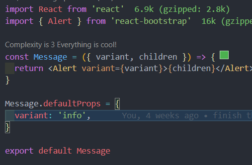

#### Handle state

By using hooks, React provide us a way to manage the state of the component while still allowing the data to be read and update

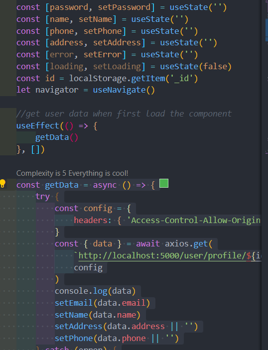

In the above example, using `useState()`  while passing the default value, we got the variable `name` which will store the value of the variable and the function 'setName()' which can used to update the variable upon call and trigger re-render the data display.

Furthermore, React also provides `userEffect(()=>{function},[])` to allow controlling the re-render when a function is called.

For higher level and large organisations with big data, `store` and Redux would be required to cope with the data flow.


### Svelte frontend

#### Start a Svelte project

```shell
npx degit sveltejs/template <project name>
cd <project name>
npm install
```

This will install a barebone Svelte webpage to get users up to speed and start working on building the website right away

#### Create a component

As the time to complete the project is much shorter than React, there are fewer chances to experience different approaches and research for the best coding practice. Below is an example Svelte component:

```html
<script>
	import { useNavigate, useLocation } from "svelte-navigator";
	import { user } from "../../store/store";
	import LoginForm from "./LoginForm.svelte";
	import RegisterForm from "./RegisterForm.svelte";
	const navigate = useNavigate();
	const location = useLocation();
	let login = true;
	function handleSubmit() {
	  	$user = { id };
	  	const from = ($location.state && $location.state.from) || "/";
	  	navigate(from, { replace: true });
	}
	const handleChangeForm = () =>{
		login = !login
	}
  </script>
<div class="container">
	<div class="row">
		<button style={!login?"background: gray":null} on:click={()=>login = true} >Login</button>
		<button style={login?"background: gray":null} on:click={()=>login = false} >Register</button>
	</div>
	<!-- Login and Register form -->
	<div class="card">
	{#if (login)}
	<div>
		<LoginForm />
	</div>
	{:else}
	<div>
		<RegisterForm />
	</div>	
	{/if}
	</div>
	
</div>
<style>
	.container {
		display: flex;
		flex-direction: column;
		align-items: center;
		margin: 50px;
	}
	.card {
		background-color: whitesmoke;
		padding: 30px;
		border-radius: 5px;
		min-width: 400px;
	}
</style>
```

The component creation is straight forward can be pretty easy for beginners to pick up from HTML and vanilla javascript instead of full javascript like React. It is important to point out that the works in React can be transferred and rebuilt in Svelte without much difficulty making the Framework very attractive, below is a screenshot of working time a team member did to rebuild a MERN stack application into MESN stack (including the research time)

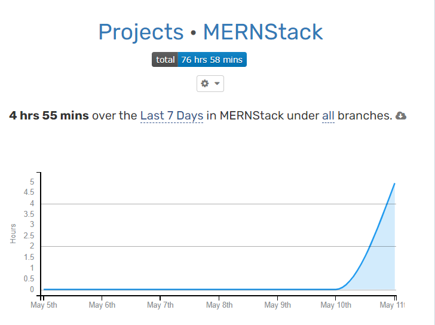

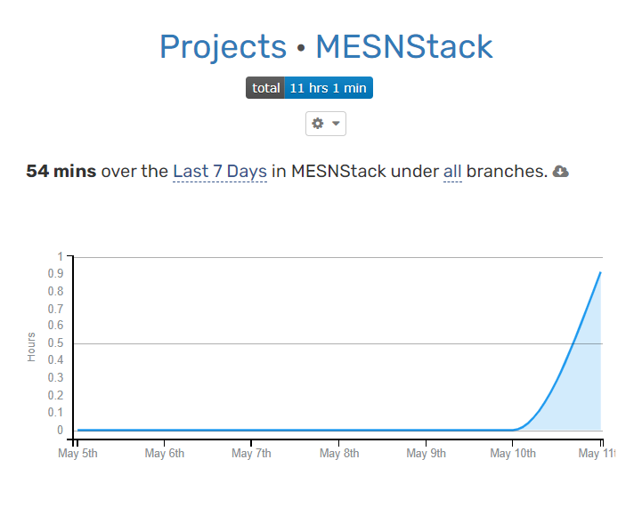

#### State management

While React uses store and third-party option to control the state like Redux, Svelte has many built-in options to manage the state such as Context API which allow passing and changing the data within the component tree and store which allow getting and setting data between different components. Those features are also available in React at the moment using react hooks.

Example:

```html
<script>
  import writable from 'svelte/store'

  export const city = writable('Milan')
</script>
//In another file
<scipt>
  import { city } from './location.js'
</script>
```


### Comparing table

Important, images can be a bit small and would be easy to view on markdown file. If needed, it is also available on in src folder for further inspection.

| Requirements                                                 | MERN Stack                                                   | MESN Stack                                                   | Differences                                                  |
| ------------------------------------------------------------ | ------------------------------------------------------------ | ------------------------------------------------------------ | ------------------------------------------------------------ |
| 1. Charity members and beneficiaries can register            | 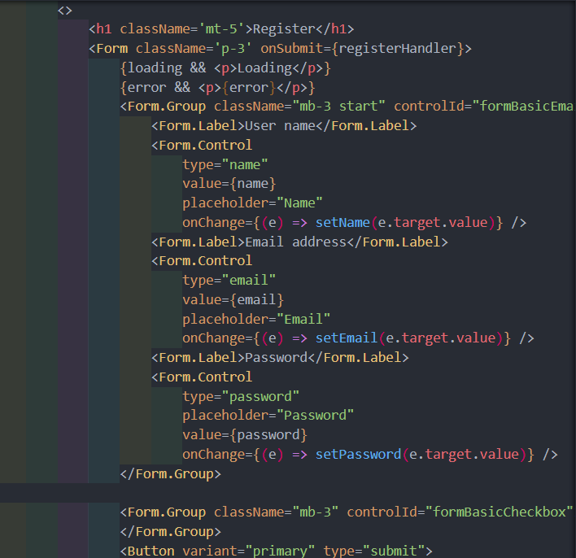 | 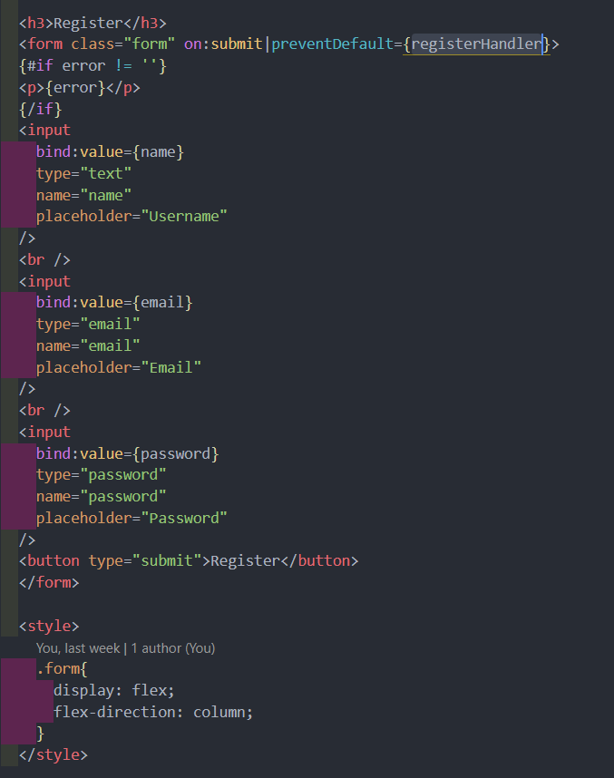 | The slight difference would be the MERN stack used Bootstrap so there are many pre-built components while for MESN just used a simple HTML tag. |
| 2. Log in                                                    | 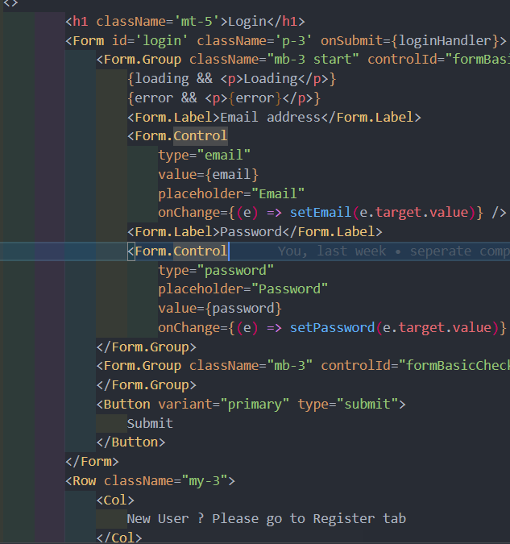 | 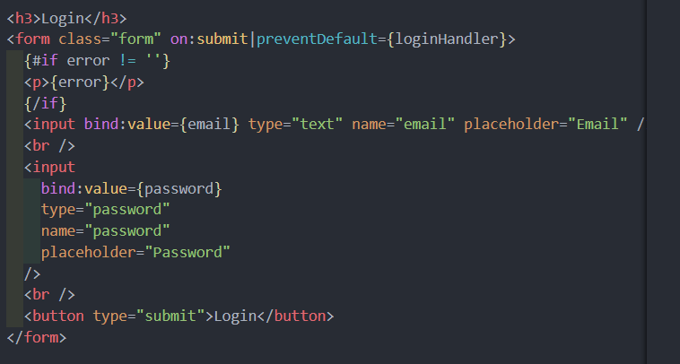 | Using the same logic to create the login form, Svelte provides better readability and actually cleaner code |
| 3. Administer their own accounts                             |  | 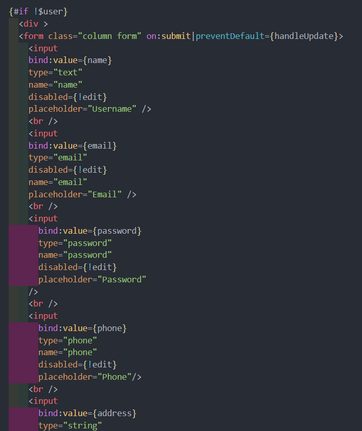 | The state is handled the same way with both frameworks which allow re-render when there is a change in the components <br/>Svelte also provides reactive declarations which are components computed from other variables to mark as re-render.<br/> The concept is a bit new and come with a bit of learning curve.For example : `$: doubled = count * 2;` |
| 4. The system provides an interface that the members can use to accept a token in a transaction. | 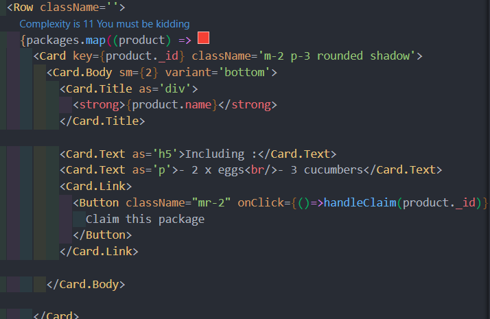 | 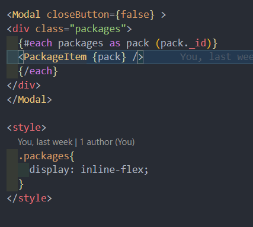 | Both frameworks provide logic to display list items using array format and allow the presence of a key or id to allow the items to be unique |
| 5. Store and retrieve data from a server-side database (API) | 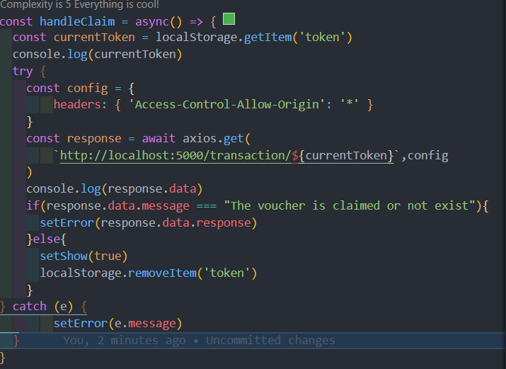 | 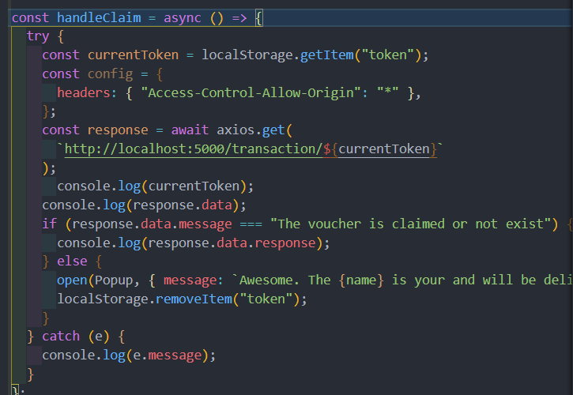 | The same logic and function can be applied using the Axios request |


## 3. Recommendation

Each framework has different strong points as well as drawbacks but provides very similar features from a top-level point of view.  For example, both provide state management solutions and divide web applications into components for control and maintenance while using easy-to-understand syntax.

For MERN stack, according to www.javatpoint.com :

- Advantage :
  - Popular framework with large community support
  - Built by Facebook
  - Bundle frontend code into components for the reusable purpose
  - Performance enhancement with the  virtual DOM
- Disadvantage :
  - Large learning curve
  - Poor Documentation due to its rate of growth

For MESN stack , according to Nimrod(2020):

- Advantage :
  - Convert code to vanilla Javascript to  improve code readability, re-use and reduces overhead
  - Do not require virtual DOM 
  - Got a lot of built-in features which React needs a third-party library such as Router, Redux.
- Disadvantage :
  - It is a new framework which still needs more IDE support and other improvement needed in order to compete with current frameworks such as React, Angular
  - Not many librlibrariesckage or dev tools for Svelte right now and the ecosystem still growing.

While from comparison and development experience, Svelte got stronger points and benefits but the framework is still new and the adoption rate of React is much higher so MERN is still the best choice for the project. Furthermore, with the MERN stack deployed, the organisation still can switch back to the Svelte frontend due to its flexibility. 

## 4. Reference

- “HTTP Response Status Codes - HTTP | MDN.” Accessed September 22, 2021. https://developer.mozilla.org/en-US/docs/Web/HTTP/Status.
- JavaScript Mastery. *Full Stack MERN Project - Build and Deploy an App | React + Redux, Node, Express, MongoDB [Part 2/2]*, 2020. https://www.youtube.com/watch?v=aibtHnbeuio.
- The Full Stack Junkie. *Full Stack ECommerce Cart Build (React, Redux, Node, Express, MongoDB)...From Scratch💥*, 2020. https://www.youtube.com/watch?v=0divhP3pEsg.
- RoadsideCoder. *Complete User Authentication in React JS , Node, Express, MongoDB with JWT - MERN Stack Tutorial #10*, 2021. https://www.youtube.com/watch?v=iw5RSIflYGU.
- “What Is a Web Framework, and Why Should I Use One?” Accessed May 11, 2022. https://welearncode.com/what-are-frontend-frameworks/.
- www.javatpoint.com. “Pros and Cons of ReactJS - Javatpoint.” Accessed May 16, 2022. https://www.javatpoint.com/pros-and-cons-of-react.
- Nimrod, Kramer. “Svelte Pros and Cons, Ecosystem Overview and Top Resources.” Accessed May 16, 2022. https://daily.dev/blog/building-with-svelte-all-you-need-to-know-before-you-start.


